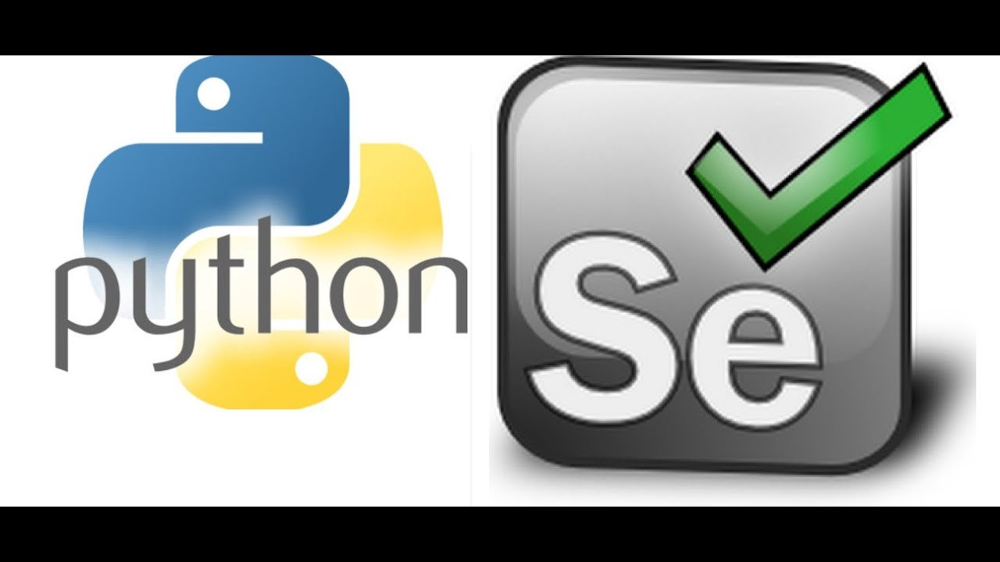
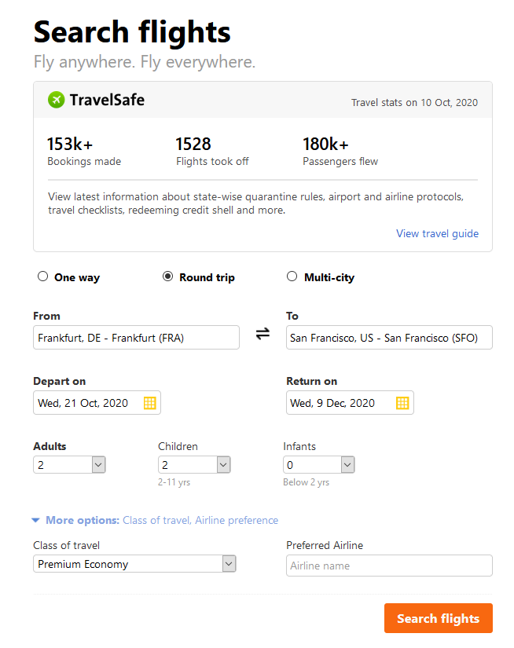
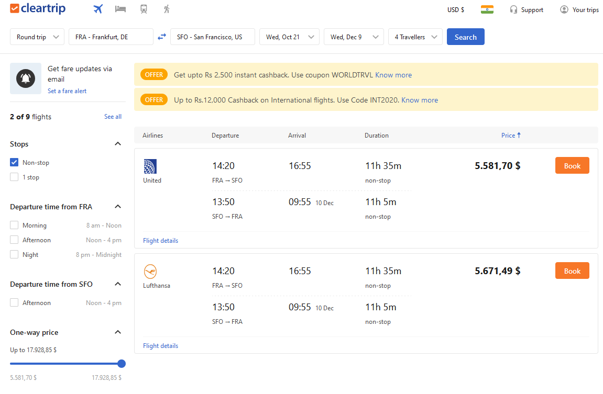

# Flight-Booking-Website-Automation [Selenium + Python]

 Youtube reference: https://www.youtube.com/watch?v=Arg1Wsjqqy8

In this project the flight booking steps are automated with Selenium WebDriver.

This tutorial will cover several important topics of Selenium, among others:

#### - Static Dropdowns
#### - Autosuggestive/ Dynamic Dropdowns
#### - Calendars
#### - Radio Buttons
#### - Handling Cookies
#### - Wait Elements
#### - Capture Screenshots
#### - Working with different windows (Parent + Child Window)
#### - Loggings
-------------------------------------------------------------

